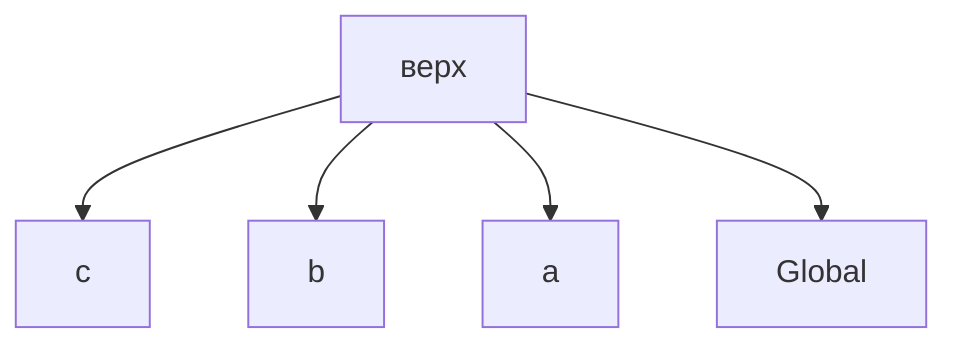
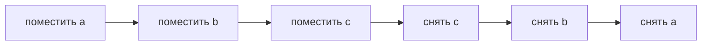

# Решения: Call Stack

## Концептуальные вопросы

### 1. Зачем JavaScript нужен Call Stack?

Ответ: чтобы управлять активными вызовами функций.

Объяснение: Call Stack помнит текущую функцию и вызывающие функции.

Ошибка: думать, что вложенные вызовы завершаются без отслеживания возврата.

QA связь: stack trace в тестах показывает цепочку вызовов helpers.

### 2. Что происходит с Call Stack при вызове функции?

Ответ: новый Execution Context помещается наверх.

Объяснение: вызванная функция становится текущим выполнением.

Ошибка: считать, что вызывающая функция исчезает.

QA связь: тест ожидает, пока helper выполняется.

### 3. Что происходит со stack, когда function завершается?

Ответ: ее Execution Context снимается с Call Stack.

Объяснение: выполнение возвращается к вызывающей функции.

Ошибка: забыть поток возврата.

QA связь: после завершения helper тест продолжается.

### 4. Почему после `c()` JavaScript возвращается в `b()`?

Ответ: потому что `b()` — вызывающая функция под `c()` в Call Stack.

Объяснение: когда Execution Context `c` снимается, Execution Context `b` становится верхним.

Ошибка: ожидать немедленный переход к глобальному коду.

QA связь: assertion helper возвращается к test helper, а не сразу к раннеру.

### 5. Что означает правило: выполняется верхний Execution Context?

Ответ: JavaScript выполняет только Execution Context наверху Call Stack.

Объяснение: у синхронного выполнения есть один текущий Execution Context.

Ошибка: думать, что `a`, `b`, `c` выполняются одновременно.

QA связь: синхронная цепочка test helpers выполняется шаг за шагом.

## Чтение кода

Ответ:



Объяснение: `a()` вызвала `b()`, а `b()` вызвала `c()`.

Ошибка: рисовать `a` наверху, когда выполняется `c`.

QA связь: верхний Execution Context обычно показывает место текущего сбоя.

## Предскажите результат выполнения

Ответ:

```text
enter a
enter b
enter c
leave c
leave b
leave a
```

Объяснение: вызовы идут внутрь вложенных функций; завершение возвращается обратно наружу.

Ошибка: напечатать все строки `enter`, а затем забыть порядок `leave`.

QA связь: setup helper завершается до того, как вызывающий код продолжит работу.

## Отладка

Ответ: ошибка возникла в `c`; выполнение пришло туда через `b`, затем через `a`.

Объяснение: верх stack trace показывает место ошибки, нижние строки показывают вызывающие функции.

Ошибка: fixing `a` when bug is inside `c`.

QA связь: stack traces helpers в Playwright читаются так же.

## QA-аналогия

Ответ: верхний Execution Context соответствует текущему assertion/helper.

Объяснение: если сейчас выполняется assertion, тест и helper ждут ниже.

Ошибка: читать stack только как хронологический список.

QA связь: текущий падающий helper обычно находится ближе к верху.

## Мини-сценарий

Ответ:

```javascript
function c() {
  console.log('enter c');
  console.log('leave c');
}

function b() {
  console.log('enter b');
  c();
  console.log('leave b');
}

function a() {
  console.log('enter a');
  b();
  console.log('leave a');
}

a();
```

Объяснение:



Ошибка: снимать вызывающую функцию раньше вызванной.

QA связь: вложенные helpers завершаются в порядке, обратном вызовам.
