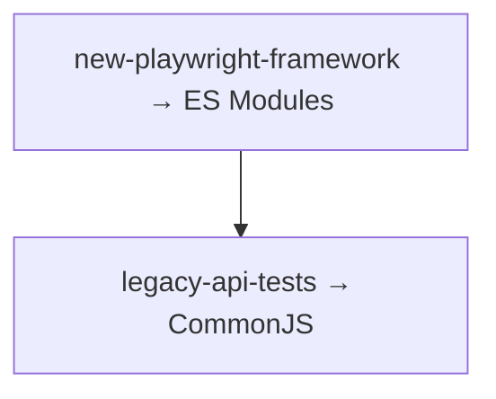

# Решения: Module Systems

## Концептуальные вопросы

### 1. Что такое ES Modules?

Ответ: современная стандартная модульная система JavaScript.

Объяснение: она использует `import` и `export`.

Типичная ошибка: считать ES Modules инструментом сборщика, а не стандартом языка.

Связь с Automation QA: современные Playwright- и TypeScript-проекты часто используют этот стиль.

### 2. Что такое CommonJS?

Ответ: модульная система, исторически распространенная в Node.js.

Объяснение: она использует `require()` и `module.exports`.

Типичная ошибка: считать CommonJS синтаксической ошибкой, если проект настроен под Node.js.

Связь с Automation QA: старые API-тесты и инфраструктурные вспомогательные модули могут быть написаны в CommonJS.

### 3. Почему существуют две модульные системы?

Ответ: исторически CommonJS появился в Node.js раньше, а ES Modules позже стали стандартом языка.

Объяснение: экосистема JavaScript развивалась постепенно, поэтому старый и новый подходы сосуществуют.

Типичная ошибка: думать, что одна система появилась как простая замена другой в один момент.

Связь с Automation QA: реальные проекты могут содержать код разных поколений.

### 4. Как распознать ES Modules?

Ответ: по `import` и `export`.

Объяснение: эти ключевые слова показывают стандартную модульную систему JavaScript.

Типичная ошибка: путать `import` с функцией.

Связь с Automation QA: Page Objects и config-файлы часто импортируются через ES Modules.

### 5. Как распознать CommonJS?

Ответ: по `require()` и `module.exports`.

Объяснение: `require()` подключает модуль, `module.exports` задает экспорт.

Типичная ошибка: искать `export` в CommonJS-файле.

Связь с Automation QA: многие старые Node.js-инструменты используют CommonJS.

### 6. Почему полезно читать оба стиля?

Ответ: потому что Automation QA-проекты часто живут долго и используют разные поколения JavaScript-кода.

Объяснение: новый код может быть на ES Modules, а старые вспомогательные модули — на CommonJS.

Типичная ошибка: уметь читать только один стиль и теряться в инфраструктурном коде.

Связь с Automation QA: инженер часто поддерживает существующий фреймворк, а не пишет все с нуля.

## Чтение кода

Ответ: это CommonJS.

Объяснение: используются `require()` и `module.exports`.

Типичная ошибка: считать любой файл с объектом экспорта ES Modules.

Связь с Automation QA: такой стиль часто встречается в старых вспомогательных модулях Node.js.

## Предскажите результат выполнения

Ответ:

```text
staging
```

Объяснение: `require()` возвращает объект, записанный в `module.exports`.

Типичная ошибка: ожидать, что нужно писать `config.default.environment`.

Связь с Automation QA: конфигурацию окружения можно импортировать через CommonJS.

## Отладка

Ответ: код смешивает `import` и `require()`, поэтому нужно понимать настройки окружения.

Объяснение: это разные module systems. Их смешивание может быть допустимо только при соответствующих настройках окружения.

Типичная ошибка: механически копировать импорт из одного проекта в другой.

Связь с Automation QA: в миграции старого фреймворка важно не смешивать стили случайно.

## Задание Automation QA

Ответ:



Объяснение: новый проект чаще использует современный стандарт, а старый Node.js-проект часто сохраняет CommonJS.

Типичная ошибка: выбирать систему только по личной привычке, а не по окружению проекта.

Связь с Automation QA: выбор module system влияет на структуру всех вспомогательных модулей и файлов конфигурации.

## Мини-проект

Ответ:

| Система | Подключение | Экспорт | Где встречается |
|---------|-------------|---------|-----------------|
| ES Modules | `import` | `export` | современные проекты |
| CommonJS | `require()` | `module.exports` | старый Node.js-код |

Объяснение: обе системы решают задачу разделения кода, но используют разный синтаксис.

Типичная ошибка: считать их полностью взаимозаменяемыми без учета окружения.

Связь с Automation QA: такая таблица помогает команде быстрее читать код фреймворка.
