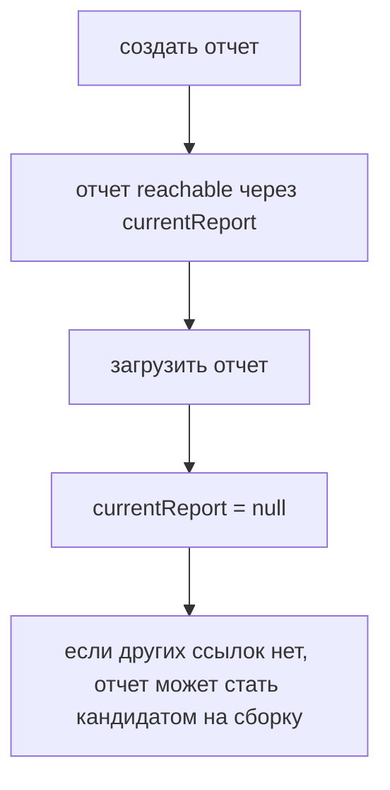
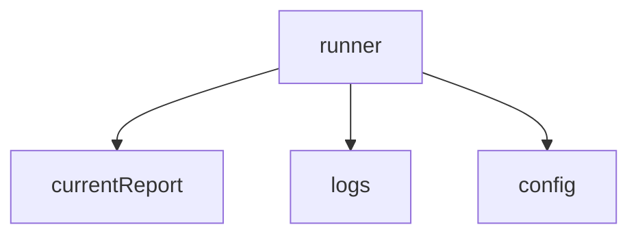
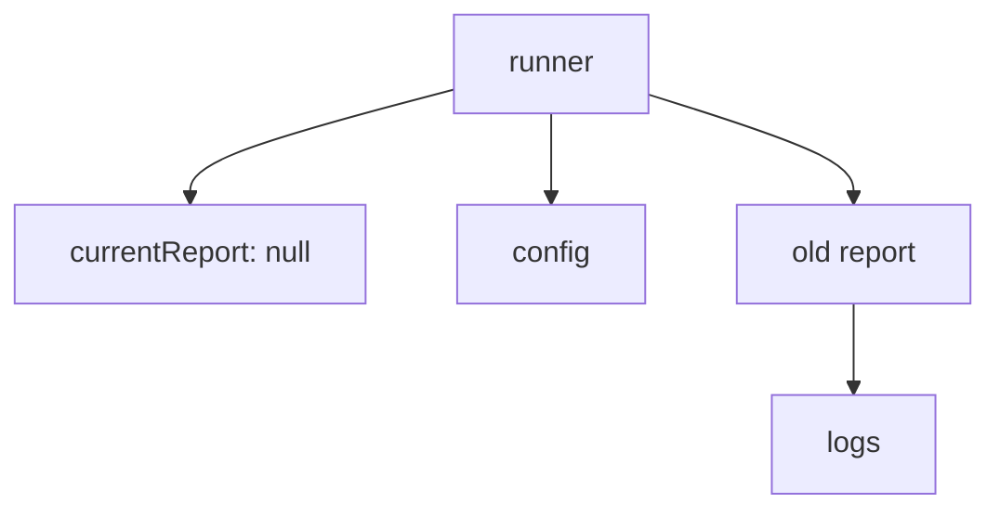

# Решения: Garbage Collector

## Концептуальные вопросы

### 1. Что делает Garbage Collector?

Ответ: он освобождает память, занятую объектами, которые стали недостижимыми.

Объяснение: если программа больше не может добраться до объекта через ссылки, объект может быть собран.

Типичная ошибка: думать, что Garbage Collector удаляет все объекты, которые логически больше не нужны.

Связь с Automation QA: старый отчет может быть очищен только после исчезновения ссылок на него.

### 2. Что означает reachable object?

Ответ: это объект, до которого есть путь через ссылки.

Объяснение: если переменная, свойство объекта или другая структура данных указывает на объект, он reachable.

Типичная ошибка: считать объект недостижимым только потому, что он давно создан.

Связь с Automation QA: отчет остается reachable, пока раннер хранит ссылку на него.

### 3. Почему JavaScript-разработчик обычно не освобождает память вручную?

Ответ: JavaScript использует автоматическое управление памятью.

Объяснение: разработчик управляет ссылками, а момент очистки выбирает среда выполнения.

Типичная ошибка: искать в обычном JavaScript специальную команду для ручного удаления объекта из памяти.

Связь с Automation QA: после загрузки отчета обычно достаточно убрать ненужные ссылки.

### 4. Почему объект не удаляется только потому, что он "старый"?

Ответ: возраст объекта не определяет его удаление.

Объяснение: решение о возможности сборки зависит от достижимости, а не от возраста объекта или его логической нужности.

Типичная ошибка: думать, что старые объекты автоматически удаляются раньше новых.

Связь с Automation QA: долгоживущая конфигурация может оставаться в памяти весь запуск.

### 5. Кто решает, когда именно запускать сборку мусора?

Ответ: среда выполнения JavaScript.

Объяснение: код не должен зависеть от точного момента запуска Garbage Collector.

Типичная ошибка: ожидать немедленную очистку после `object = null`.

Связь с Automation QA: тесты не должны проверять внутренний момент освобождения памяти.

## Чтение кода

Ответ: reachable остаются `runner` и объект `report` внутри него.

Объяснение: `runner.report` содержит ссылку на объект отчета.

Типичная ошибка: смотреть только на локальные переменные и забывать про вложенные свойства.

Связь с Automation QA: раннер часто удерживает текущий отчет через свойство объекта.

## Предскажите результат

Ответ: код выведет `passed`.

Объяснение: `report = null` убирает только одну ссылку. Переменная `archivedReport` продолжает ссылаться на тот же объект.

Типичная ошибка: считать, что объект исчезает после сброса первой переменной.

Связь с Automation QA: отчет может оставаться reachable через архив, историю запусков или общий буфер.

## Определение удерживаемых объектов

Ответ: объект отчета удерживается переменной `lastReport`.

Объяснение: даже после `currentReport = null` вторая ссылка все еще указывает на тот же объект.

Типичная ошибка: думать, что сброс одной ссылки всегда делает объект недостижимым.

Связь с Automation QA: один отчет может удерживаться несколькими частями фреймворка.

## Отладка

Ответ: потому что `report = null` только убирает ссылку.

Объяснение: точный момент сборки мусора выбирает среда выполнения, поэтому тест не должен зависеть от немедленного освобождения памяти.

Типичная ошибка: путать "объект может быть собран" и "объект уже собран".

Связь с Automation QA: автотесты должны проверять поведение программы, а не момент работы Garbage Collector.

## Задание Automation QA

Ответ:

Объяснение: объект становится кандидатом на сборку только после исчезновения всех путей к нему.

Типичная ошибка: забыть, что отчет может удерживаться логгером, кэшем или массивом истории.

Связь с Automation QA: после загрузки отчета полезно очищать временные ссылки.

## Мини-проект

Ответ:

После `runner.currentReport = null`:

Объяснение: если на `old report` нет других ссылок, он и его `logs` могут стать недостижимыми.

Типичная ошибка: считать `logs` reachable только потому, что они были вложены в отчет.

Связь с Automation QA: вложенные логи освобождаются только вместе с недостижимым отчетом.
