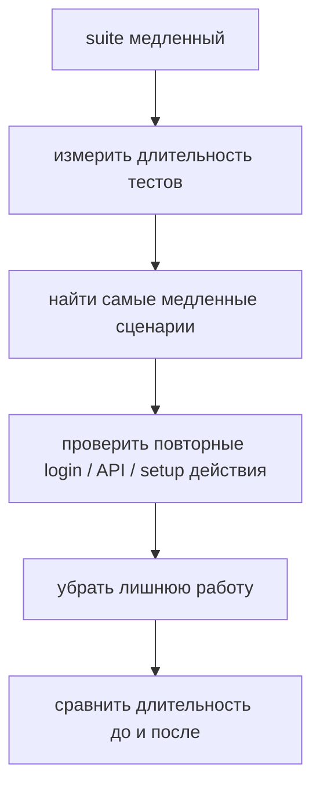

# Решения: Performance

## Концептуальные вопросы

### 1. Почему optimization без measurement считается догадкой?

Ответ: потому что без measurement неизвестно, какая часть кода действительно создает проблему.

Объяснение: можно усложнить быстрый участок кода и не затронуть реальный bottleneck.

Типичная ошибка: переписывать код только потому, что он "кажется медленным".

Связь с Automation QA: перед ускорением suite нужно знать, какие тесты или setup-шаги занимают больше всего времени.

### 2. Почему читаемость кода обычно важнее микровыгоды?

Ответ: читаемый код проще поддерживать, проверять и безопасно изменять.

Объяснение: маленькое неизмеренное ускорение редко оправдывает сложность, если код становится непонятным.

Типичная ошибка: использовать хитрые конструкции без доказанной пользы.

Связь с Automation QA: тестовый фреймворк должен быть понятен всей команде, а не только автору optimization.

### 3. Что означает bottleneck в программе?

Ответ: это участок, который заметно ограничивает скорость или расход ресурсов всей программы.

Объяснение: optimization должна быть направлена именно на bottleneck, потому что улучшение других мест почти не изменит результат.

Типичная ошибка: улучшать случайные строки вместо анализа реального bottleneck.

Связь с Automation QA: узким местом может быть login перед каждым тестом, повторный API-запрос или тяжелая подготовка данных.

### 4. Почему повторные API-запросы могут замедлять тестовый suite?

Ответ: каждый запрос требует времени и может зависеть от сети, сервера и окружения.

Объяснение: если одни и те же данные запрашиваются несколько раз без необходимости, suite делает лишнюю работу.

Типичная ошибка: вызывать setup API в каждом тесте, даже если данные можно подготовить один раз.

Связь с Automation QA: уменьшение повторных запросов часто ускоряет CI без сложных optimization-приемов.

### 5. Почему после optimization нужно измерить результат снова?

Ответ: чтобы проверить, действительно ли изменение помогло.

Объяснение: без повторного measurement нельзя отличить реальное улучшение от предположения.

Типичная ошибка: считать optimization успешной сразу после изменения кода.

Связь с Automation QA: после изменения setup или retries нужно сравнить длительность suite до и после.

## Чтение кода

Ответ: `getTotalDuration(testRuns)` вызывается два раза для одних и тех же данных.

Объяснение: сумма длительностей не меняется между вызовами, поэтому результат можно сохранить в переменную.

Типичная ошибка: не замечать повторный расчет, если он спрятан внутри выражения.

Связь с Automation QA: похожая проблема возникает, когда отчет или test data пересчитываются несколько раз за один сценарий.

## Предскажите поведение

Ответ: код выведет `['T-2']`.

Объяснение: только тест `T-2` имеет `durationMs > 1000`.

Типичная ошибка: включить `T-3`, хотя `900` меньше порога.

Связь с Automation QA: такие проверки помогают выделять медленные тесты в отчете.

## Задание на отладку

Ответ: увеличение timeout не доказывает, что performance-проблема исправлена.

Объяснение: timeout только разрешает тесту ждать дольше. Он не находит bottleneck и не убирает лишние действия, повторные запросы или нестабильное ожидание.

Типичная ошибка: считать рост timeout optimization-исправлением.

Связь с Automation QA: в Playwright timeout иногда нужен, но сначала стоит понять, что именно тест ожидает.

## Задание Automation QA

Ответ:



Объяснение: такой план не угадывает причину, а постепенно сужает область анализа.

Типичная ошибка: начинать с переписывания тестов без данных о длительности.

Связь с Automation QA: CI-ускорение обычно начинается с отчета по длительности тестов.

## Мини-проект

Ответ:

```javascript
function createPerformanceReport(testResults) {
  const totalDurationMs = testResults.reduce((total, test) => {
    return total + test.durationMs;
  }, 0);

  const slowTests = testResults.filter((test) => test.durationMs > 1000);

  return {
    totalDurationMs,
    slowTests,
    averageDurationMs: totalDurationMs / testResults.length,
  };
}
```

Объяснение: `totalDurationMs` считается один раз и затем используется для среднего значения. Это убирает потенциальный повторный расчет, если объем отчета вырастет.

Типичная ошибка: считать общую длительность отдельно для `totalDurationMs` и отдельно для `averageDurationMs`.

Связь с Automation QA: такой отчет помогает понять, какие тесты стоит анализировать первыми.
