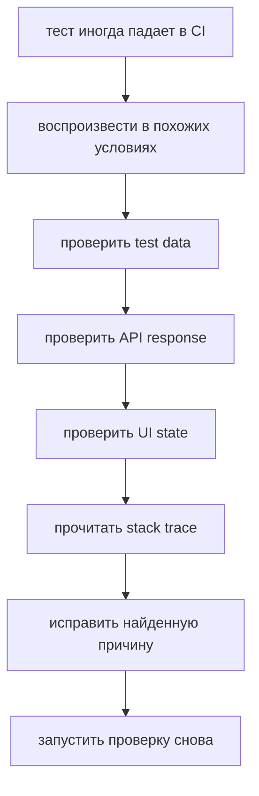

# Решения: Debugging

## Концептуальные вопросы

### 1. Почему debugging начинается с воспроизведения проблемы?

Ответ: без воспроизведения трудно проверить причину и доказать, что исправление помогло.

Объяснение: если ошибка появляется случайно, сначала нужно понять условия, при которых она возникает.

Типичная ошибка: исправлять код до того, как проблема повторена.

Связь с Automation QA: flaky test нужно попытаться воспроизвести локально, в CI или на похожих данных.

### 2. Что означает "изолировать проблему"?

Ответ: уменьшить область поиска до конкретного места, данных или условия.

Объяснение: вместо анализа всего приложения нужно постепенно отделять рабочие части от подозрительных, чтобы перейти от symptom к root cause.

Типичная ошибка: исследовать весь тест сразу и не проверять промежуточные состояния.

Связь с Automation QA: можно отдельно проверить test data, API response, selector и assertion.

### 3. Почему нельзя менять несколько вещей одновременно?

Ответ: после нескольких изменений непонятно, какое из них повлияло на результат.

Объяснение: debugging требует контролируемых шагов.

Типичная ошибка: одновременно менять selector, timeout и test data.

Связь с Automation QA: при flaky test это может временно скрыть проблему, но не объяснить ее.

### 4. Чем полезен stack trace?

Ответ: он показывает место ошибки и цепочку вызовов, которая к ней привела.

Объяснение: stack trace помогает понять путь выполнения программы.

Типичная ошибка: читать только последнюю строку ошибки и игнорировать вызовы выше.

Связь с Automation QA: stack trace может показать, в каком helper, page object или assertion возникла ошибка.

### 5. Почему `console.log()` должен проверять конкретное предположение?

Ответ: иначе лог добавляет шум, но не приближает к причине.

Объяснение: полезный лог отвечает на вопрос: какое значение реально было в этой точке и какое предположение мы проверяем?

Типичная ошибка: добавлять `console.log('here')` без данных.

Связь с Automation QA: лучше вывести expected/actual status, test id или API response fragment.

## Чтение кода

Ответ: результат пустой, потому что код ищет статус `'failed'`, а во входных данных записано `'fail'`.

Объяснение: `filter()` работает корректно. Ошибка находится в несоответствии данных и условия.

Типичная ошибка: подозревать метод массива вместо проверки входных данных.

Связь с Automation QA: похожая проблема возникает, когда API и тест используют разные значения статусов.

## Предскажите поведение

Ответ: код выведет `false`.

Объяснение: `getStatus(report)` возвращает `'pending'`, а сравнение идет со строкой `'passed'`.

Типичная ошибка: смотреть только на функцию и не проверить фактические данные.

Связь с Automation QA: assertion падает не только из-за теста, но и из-за реального состояния системы.

## Задание на отладку

Ответ: сначала нужно проверить, откуда пришел `pageStatus` и чему он реально равен.

Объяснение: перед изменением assertion нужно понять, где root cause: в ожидании, данных, UI или источнике статуса.

Типичная ошибка: сразу менять expected value или добавлять retry.

Связь с Automation QA: полезно вывести order id, expected status, actual status и API response status.

## Задание Automation QA

Ответ:



Объяснение: план отделяет проблему данных, API, UI и тестового кода.

Типичная ошибка: заменить исследование большим timeout.

Связь с Automation QA: такой план помогает отличить bug продукта от ошибки автотеста.

## Мини-проект

Ответ:

```javascript
function debugTestResult(result) {
  const matches = result.expectedStatus === result.actualStatus;

  console.log(`test id: ${result.testId}`);
  console.log(`expected: ${result.expectedStatus}`);
  console.log(`actual: ${result.actualStatus}`);
  console.log(`matches: ${matches}`);

  if (!matches) {
    console.log('next step: check test data, API response, and UI state');
  }
}
```

Объяснение: helper выводит конкретные значения, которые помогают проверить предположение и перейти от symptom к root cause.

Типичная ошибка: писать много случайных логов без expected/actual данных.

Связь с Automation QA: такой helper полезен при анализе падений в CI-логах.
