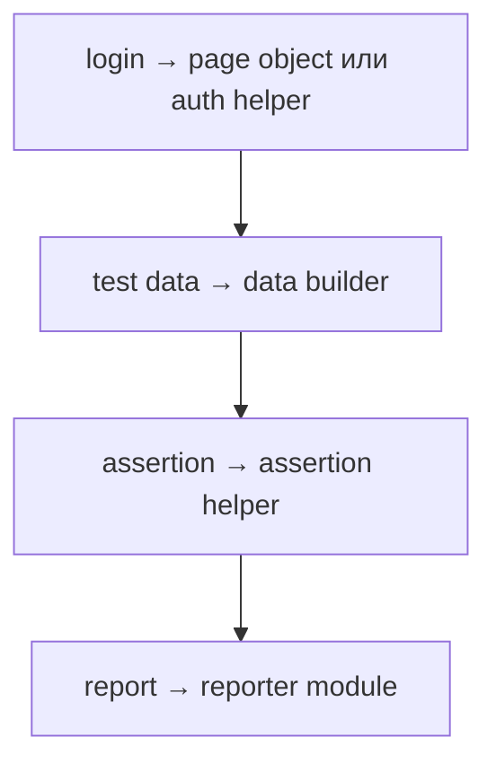

# Решения: Modern JavaScript Features

## Концептуальные вопросы

### 1. Почему modern JavaScript — это не набор отдельных фич?

Ответ: потому что в реальном коде features работают вместе для одной задачи.

Объяснение: modules, destructuring, async/await и safe access обычно соединяются в одном helper или workflow.

Типичная ошибка: изучать каждую возможность изолированно и не понимать, как она помогает проекту.

Связь с Automation QA: тестовый framework соединяет helpers, page objects, config и reporting.

### 2. Как modules помогают контролировать границы проекта?

Ответ: modules показывают, что файл отдает наружу и что использует из других файлов.

Объяснение: это уменьшает хаос зависимостей и делает ответственность файлов понятнее.

Типичная ошибка: экспортировать все подряд без публичной идеи модуля.

Связь с Automation QA: `assertions`, `fixtures` и `reporter` должны иметь понятные public APIs.

### 3. Зачем optional chaining полезен в test result objects?

Ответ: test result может не содержать всех вложенных данных.

Объяснение: optional chaining позволяет безопасно читать вложенное поле без падения на отсутствующем объекте.

Типичная ошибка: использовать optional chaining вместо понимания обязательных данных.

Связь с Automation QA: metadata отчета может отличаться между локальным запуском и CI.

### 4. Когда `async` / `await` делает helper-код понятнее?

Ответ: когда helper выполняет асинхронные шаги последовательно.

Объяснение: `await` помогает читать код как понятный сценарий действий.

Типичная ошибка: использовать `await` без понимания, где реально появляется Promise.

Связь с Automation QA: login, API setup и upload report часто являются асинхронными операциями.

### 5. Почему не стоит использовать современный синтаксис только ради самого синтаксиса?

Ответ: синтаксис должен делать намерение понятнее.

Объяснение: если feature усложняет чтение, она не улучшает код.

Типичная ошибка: превращать простую функцию в демонстрацию всех возможностей языка.

Связь с Automation QA: тесты должны быстро читаться при разборе падений.

## Чтение кода

Ответ: используются `async function`, destructuring, default value, nullish coalescing, optional chaining и object shorthand.

Объяснение: функция безопасно достает данные и возвращает summary.

Типичная ошибка: видеть только синтаксис и не понимать задачу функции.

Связь с Automation QA: такой helper похож на подготовку test report metadata.

## Предскажите результат

Ответ: код выведет `chromium`.

Объяснение: `environment` отсутствует, optional chaining возвращает `undefined`, затем `??` использует значение по умолчанию.

Типичная ошибка: ожидать ошибку доступа к `browser`.

Связь с Automation QA: browser по умолчанию часто нужен для локальных отчетов.

## Задание на отладку

Ответ: функция смешивает UI-действия, данные пользователя и report.

Объяснение: у функции слишком много ответственностей, поэтому ее трудно тестировать и менять.

Типичная ошибка: считать, что `async` helper автоматически является хорошей архитектурой.

Связь с Automation QA: login action, user data и report step лучше разделять.

## Задание Automation QA

Ответ:



Объяснение: каждая часть получает отдельную ответственность.

Типичная ошибка: держать весь сценарий в одном helper.

Связь с Automation QA: такое разделение упрощает поддержку Playwright framework.

## Мини-проект

Ответ:

```javascript
function createModernTestSummary(testResult) {
  const { title, status, meta = {}, ...rest } = testResult;

  return {
    title,
    status,
    owner: meta.owner ?? 'unknown',
    browser: meta.environment?.browser ?? 'chromium',
    ...rest,
  };
}
```

Объяснение: функция объединяет несколько изученных возможностей без нового синтаксиса.

Типичная ошибка: использовать spread так, что он случайно перезаписывает важные поля.

Связь с Automation QA: summary помогает нормализовать данные для report.
