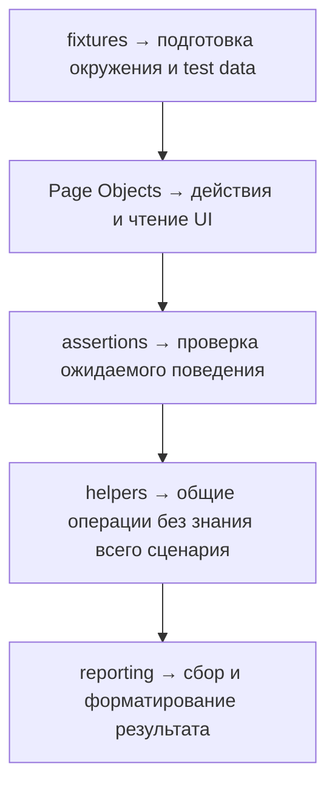

# Решения: JavaScript Best Practices

## Концептуальные вопросы

### 1. Почему readability важнее cleverness?

Ответ: код чаще читают и меняют, чем пишут заново.

Объяснение: clever code может быть коротким, но трудным для debugging и refactoring.

Типичная ошибка: выбирать эффектную запись вместо понятной.

Связь с Automation QA: тесты должны быстро объяснять, что проверяется.

### 2. Что означает single responsibility для helper-функции?

Ответ: helper должен решать одну понятную задачу.

Объяснение: если функция делает несколько разных вещей, ее трудно переиспользовать и тестировать.

Типичная ошибка: объединять setup, action, assertion и reporting.

Связь с Automation QA: отдельные helpers для data, UI action и assertion поддерживать проще.

### 3. Почему duplication опасен в Page Objects?

Ответ: изменение selector или логики придется повторять в нескольких местах.

Объяснение: duplication увеличивает риск неполного исправления.

Типичная ошибка: копировать одинаковые методы между page objects.

Связь с Automation QA: общий component object часто лучше копирования selector-логики.

### 4. Когда defensive programming полезен?

Ответ: когда функция защищает важную границу от некорректного входа.

Объяснение: проверка должна предотвращать понятную ошибку, а не быть случайной.

Типичная ошибка: добавлять проверки без понимания, какую проблему они ловят.

Связь с Automation QA: helper может явно проверять, что test id или config переданы корректно.

### 5. Почему premature optimization может ухудшить код?

Ответ: она усложняет код до того, как найден реальный bottleneck.

Объяснение: без measurement непонятно, нужна ли optimization вообще.

Типичная ошибка: жертвовать читаемостью ради предполагаемой скорости.

Связь с Automation QA: сначала нужно измерить slow tests, а не переписывать весь framework.

## Чтение кода

Ответ: нарушены clear naming, single responsibility и predictable flow.

Объяснение: имена `t`, `a`, `b`, `c` ничего не объясняют; функция логирует, меняет массив и возвращает boolean.

Типичная ошибка: считать короткие имена допустимыми в production helper.

Связь с Automation QA: такой helper трудно читать в CI failure.

## Предскажите результат

Ответ: код выведет `false`.

Объяснение: статус `'failed'` не равен `'passed'` или `'skipped'`.

Типичная ошибка: не проверить все ветки boolean-условия.

Связь с Automation QA: такие helpers делают assertions понятнее.

## Задание на отладку

Ответ: helper одновременно меняет user, page и report, а затем делает проверку.

Объяснение: это смешивает подготовку данных, состояние страницы, reporting и assertion.

Типичная ошибка: думать, что одна большая функция проще, потому что все находится в одном месте.

Связь с Automation QA: лучше разделить fixture setup, page состояние и assertion.

## Задание Automation QA

Ответ:



Объяснение: у каждой части есть одна основная ответственность.

Типичная ошибка: позволить Page Object создавать test data и писать report.

Связь с Automation QA: разделение ответственности снижает стоимость изменений.

## Мини-проект

Ответ:

```javascript
function isPassed(status) {
  return status === 'passed';
}

function createStatusMessage(title, status) {
  return `${title}: ${status}`;
}

function validateTestResult(result) {
  if (!result.title) {
    throw new Error('title is required');
  }

  if (!result.status) {
    throw new Error('status is required');
  }

  return true;
}
```

Объяснение: каждая функция делает одну вещь, поэтому код проще тестировать и менять.

Типичная ошибка: объединить validation, message и status check в одну большую функцию.

Связь с Automation QA: такие helpers можно переиспользовать в assertions и reports.
