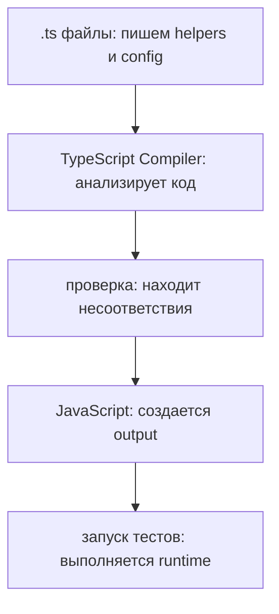

# Решения: TypeScript Compiler

## Концептуальные вопросы

### 1. Какую роль выполняет TypeScript Compiler до запуска программы?

Ответ: он анализирует TypeScript-код, находит возможные ошибки типов и генерирует JavaScript.

Объяснение: компилятор TypeScript работает до runtime и помогает увидеть несогласованные договоренности раньше запуска.

Типичная ошибка: думать, что компилятор TypeScript запускает программу.

Связь с Automation QA: ошибка в helper или config может быть найдена до запуска тестового набора.

### 2. Почему компилятор TypeScript не является JavaScript runtime?

Ответ: компилятор TypeScript проверяет и преобразует код, а runtime выполняет JavaScript.

Объяснение: после компиляции программа запускается как обычный JavaScript.

Типичная ошибка: ожидать, что TypeScript будет присутствовать во время выполнения.

Связь с Automation QA: Playwright запускает JavaScript, полученный из TypeScript-проекта.

### 3. Что означает фраза "TypeScript генерирует JavaScript"?

Ответ: `.ts`-код преобразуется в `.js`-код, понятный runtime.

Объяснение: JavaScript runtime не выполняет TypeScript-типы напрямую.

Типичная ошибка: считать TypeScript отдельной средой выполнения.

Связь с Automation QA: тестовый проект пишется с проверками TypeScript, но запускается как JavaScript.

### 4. Почему ранняя проверка особенно полезна в Automation QA framework?

Ответ: она уменьшает количество ошибок, которые доходят до CI и длинных end-to-end сценариев.

Объяснение: чем раньше ошибка найдена, тем дешевле понять ее источник.

Типичная ошибка: полагаться только на падение теста.

Связь с Automation QA: неверный тип retry count лучше найти до запуска test runner.

### 5. Какие ошибки компилятор TypeScript может показать раньше запуска тестов?

Ответ: неправильные значения, несогласованные аргументы функций и неверные присваивания.

Объяснение: компилятор TypeScript проверяет договоренности, видимые из кода.

Типичная ошибка: ожидать от компилятора TypeScript проверки бизнес-логики.

Связь с Automation QA: компилятор TypeScript может заметить неверный тип `timeoutMs`, но не проверит доступность сервера.

## Чтение кода

Ответ: `retryCount` объявлен как `number`, но получает строку.

Объяснение: значение `'three'` не соответствует ожидаемому числу.

Типичная ошибка: воспринимать это как runtime-проблему, хотя ее можно увидеть до запуска.

Связь с Automation QA: количество retries должно быть числом, иначе поведение test runner станет неясным.

## Предскажите результат проверки

Ответ: код согласован.

Объяснение: `projectName` получает строку, `testCount` получает число.

Типичная ошибка: искать проблему там, где значения соответствуют ожиданиям.

Связь с Automation QA: такие простые договоренности полезны для config и report metadata.

## Задание на отладку

Ответ: `timeoutMs` должен быть числом, но получает строку `'5000'`.

Объяснение: компилятор TypeScript должен показать несоответствие до runtime.

Типичная ошибка: думать, что строка с цифрами эквивалентна числу.

Связь с Automation QA: timeout как строка может привести к неожиданной обработке в helper.

## Задание Automation QA

Ответ: `retries` должен быть числом, но получает строку.

Объяснение: test runner ожидает числовую настройку для повторов. Компилятор TypeScript может показать проблему до запуска, но тесты все равно нужны для проверки реального поведения.

Типичная ошибка: считать, что TypeScript заменяет тесты.

Связь с Automation QA: TypeScript защищает config contract, а тесты проверяют сценарии.

## Мини-проект

Ответ:

Объяснение: компилятор TypeScript добавляет этап проверки между написанием кода и запуском.

Типичная ошибка: смешивать compiler analysis и runtime execution.

Связь с Automation QA: такой workflow снижает риск падений из-за неверных договоренностей между слоями framework.
