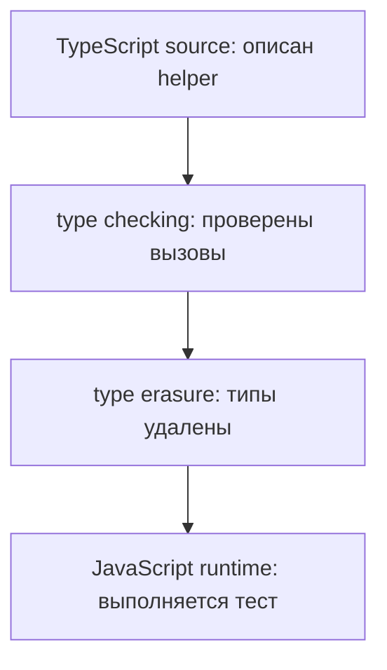

# Решения: Type Erasure

## Концептуальные вопросы

### 1. Что такое Type Erasure?

Ответ: удаление TypeScript-типов при генерации JavaScript.

Объяснение: типы нужны компилятору TypeScript, но не выполняются runtime.

Типичная ошибка: ожидать, что типы останутся в `.js`-файле.

Связь с Automation QA: runtime тестов не видит TypeScript-аннотации.

### 2. Почему TypeScript-типы удаляются после компиляции?

Ответ: JavaScript runtime не понимает TypeScript-синтаксис типов.

Объяснение: output должен быть обычным JavaScript.

Типичная ошибка: считать TypeScript новым runtime-языком.

Связь с Automation QA: Playwright запускает JavaScript-код.

### 3. Почему JavaScript runtime не видит TypeScript-типы?

Ответ: они существуют только на этапе compile time.

Объяснение: после type checking компилятор TypeScript убирает type information.

Типичная ошибка: пытаться прочитать TypeScript-тип во время выполнения.

Связь с Automation QA: runtime-проверку нужно писать отдельно.

### 4. Почему Type Erasure важен для понимания ограничений TypeScript?

Ответ: он показывает, что TypeScript не проверяет реальные runtime-данные автоматически.

Объяснение: после компиляции программа выполняется без типов.

Типичная ошибка: ожидать защиты от любого неверного API response.

Связь с Automation QA: response assertions остаются частью теста.

### 5. Почему runtime-проверка остается нужна для внешних данных?

Ответ: внешние данные появляются после компиляции.

Объяснение: компилятор TypeScript не знает, что реально вернет API или окружение.

Типичная ошибка: доверять данным только потому, что в коде есть тип.

Связь с Automation QA: API, config и environment values требуют проверок.

## Чтение кода

Ответ: исчезнут `: string` и `: number`.

Объяснение: это TypeScript type annotations, они нужны только компилятору TypeScript.

Типичная ошибка: ожидать их в JavaScript output.

Связь с Automation QA: runtime будет видеть только значения `baseUrl` и `timeoutMs`.

## Предскажите результат

Ответ:

```javascript
const reportName = 'smoke-report';

console.log(reportName);
```

Объяснение: тип `string` удаляется.

Типичная ошибка: думать, что JavaScript output хранит информацию о типе.

Связь с Automation QA: report helper в runtime работает с обычной строкой.

## Задание на отладку

Ответ: `response.status` реально является числом, хотя функция ожидает строку.

Объяснение: `JSON.parse` дает runtime-данные, и TypeScript-типы не проверяют их автоматически.

Типичная ошибка: считать данные из JSON безопасными без проверки.

Связь с Automation QA: API response нужно валидировать до использования в helper.

## Задание Automation QA

Ответ: TypeScript может проверить код, где статус передается как строка. Он не может заранее знать, что сервер реально вернет.

Объяснение: response приходит после запуска.

Типичная ошибка: заменить assertion типом.

Связь с Automation QA: типы помогают писать код, assertions проверяют реальный ответ.

## Мини-проект

Ответ:



Объяснение: TypeScript помогает до запуска, но runtime получает JavaScript.

Типичная ошибка: ждать runtime-проверки от TypeScript type annotations.

Связь с Automation QA: это объясняет, почему в API tests нужны и типы, и assertions.
